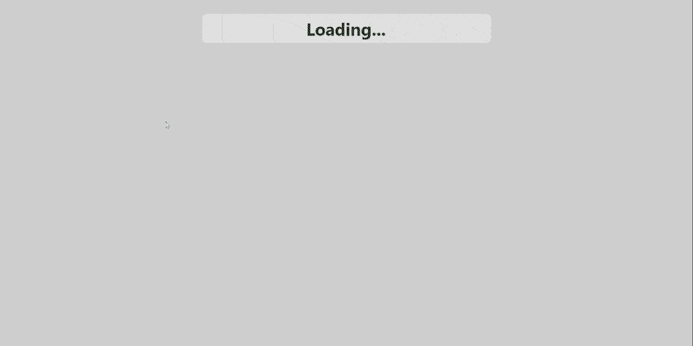

# Todo list app made with Svelte

This application was created as a learning exercise, to learn more about Svelte.
It was created based on the Svelte Typescript template using the following npm command:

```bash
npm init vite@latest
```

The application allows to create, edit and delete a list of todo items. The data is fetched from a REST API on `http:localhost:9000`.

I created a REST API that can be used to serve data to this application. You can find it in this link https://github.com/vladvaz/play-scala-api.


# Run the app

## Pre-requisites

- Node.js

## Start the app

In the root folder run the following commands:

- install dependencies with

  ```bash
  npm install
  ```

- run the app

  ```bash
  npm run dev
  ```

- open http://localhost:3000/ and you should see a todo list like so:

  